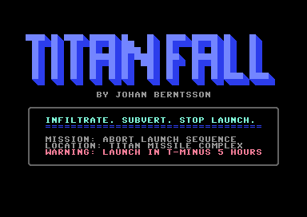
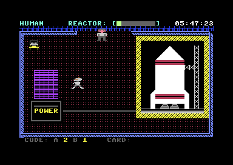
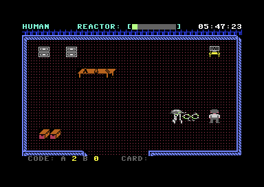
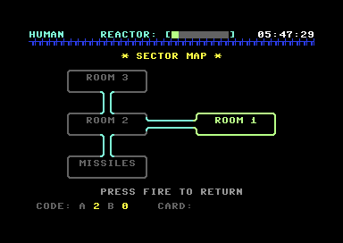

# TITAN Fall

*Infiltrate. Subvert. Stop launch.*

A cinematic infiltration puzzle game for the Commodore 64, in the spirit of
*Impossible Mission* and *Paradroid*. You have broken into TITAN, an
automated missile launch complex run by robots. The launch countdown is
already running. Take over the robots from the complex's own terminals and
use them to stop the launch before the clock reaches zero.

By Johan Berntsson. Music: the original theme *Countdown*.

| | |
|---|---|
|  |  |
|  |  |

## Running it

Download [`release/titanfall.d64`](release/titanfall.d64). In VICE: `x64sc titanfall.d64`.
On a real C64 (PAL; the game is timed for 50 Hz):

```
LOAD "TITANFALL",8
RUN
```

## Controls

Joystick in port 2. The keyboard works the same way: WASD moves and Space is fire.

| Action | Joystick | Keyboard |
|---|---|---|
| Walk / drive a robot | stick | W A S D |
| Open a terminal (stand by a console) | fire | Space |
| Search (hold) | hold fire | hold Space |
| Shoot (while driving a robot that has a gun) | fire | Space |
| Terminal menu: move / select / leave | up, down / fire | W, S / Space or Return / F7 |
| Where am I? (room and position) | | F2 |

## How to play

- **The clock.** The countdown in the top right is your real deadline. When it
  reaches zero, the mission has failed. The reactor gauge next to it heats up
  as time runs out.
- **Dying costs time.** Lasers, robots and their weapons kill on contact.
  Each death costs 30 minutes of countdown, and you start again from the
  entry room. Anything you've found stays found.
- **Searching.** Stand on a piece of furniture or anything else in the room
  and hold fire to search it, Impossible Mission style (bare floor has
  nothing to search). It takes a moment, and the robots don't wait while you
  search.
- **Terminals.** The consoles let you view the sector map and take over a
  robot in the same room. Taking one over costs a **security code** of the
  right type (shown on the bottom line, e.g. `CODE: A 2 B 0`). The link
  lasts **30 seconds**: the countdown is shown in the top left, and then
  control snaps back to you.
- **Robots** each behave differently. Some patrol, some charge when they see
  you, some shoot, and some advance behind a force field. Most of them see
  along their own row, so keep that in mind.
- **Cards** open locked doors. A carried card is shown on the bottom line
  (`CARD:`), and it's used up when it opens its door.

Hints, for when you're stuck:

<details>
<summary>Spoilers</summary>

1. The laser in the first room can't be crossed on foot, but a robot driven
   into it will burn it out (and itself with it).
2. Something red is hidden behind that laser.
3. One room holds a security code of a type you don't start with.
4. The missile room's power stack is what keeps the launch alive, and the
   robot guarding it has a gun.

</details>

## Building from source

Needs Python 3 with PyYAML, [ACME](https://sourceforge.net/projects/acme-crossass/)
0.97, [Exomizer](https://bitbucket.org/magli143/exomizer) and
[VICE](https://vice-emu.sourceforge.io/) (`x64sc`, and `c1541` for the disk image).

```
make          # build titanfall.prg
make run      # build and start it in VICE
make release  # build release/titanfall.d64
make clean
```

The world (rooms, robots, items, doors, lasers, security codes, the clock)
is defined in `titan.yaml`, and the room art is drawn in
[vchar64](https://github.com/ricardoquesada/vchar64) (`graphics/`). The
build turns both into assembly data, so most content changes don't need any
code. `CLAUDE.md` describes the code and its design in detail.
